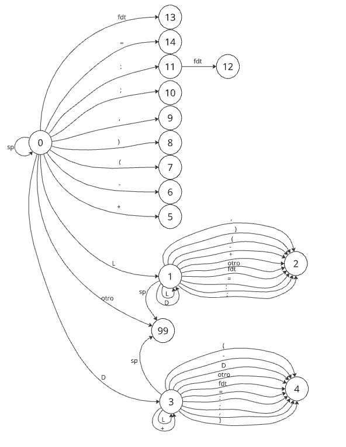

# SSL Micro Scanner

Scanner para el lenguaje Micro como está definido en el libro del profesor Muchnik de Sintaxis y Semántica de los Lenguajes

## Integrantes del grupo
- Kevin Cadenas <br>
- Ignacio Jubilla <br>
- Lucio De Goñi <br>
- Simón Rojas <br>
- Máximo Sarba <br>
- Leandro Chen <br>
- Zoe Ana Ines Yusti <br>
- Ariel Gerardo Vaca <br>
- Tomas Valentin Parisi <br>
- GastÓn César Mongelos <br>

## Instrucciones para compilar
 mingw32-make 

## Instrucciones para probar
 - cd a la carpeta scanner, donde esta el Makefile  
 - mingw32-make test

## Diagrama de transiciones


## Qué cambios hicimos y por qué

  - Primero redefinimos el Token en el scanner.h con enum para que cada Token tenga un número asignado.
  ```C++
  typedef enum {
      INICIO, FIN, LEER, ESCRIBIR, ID, CONSTANTE, PARENIZQUIERDO,  
      PARENDERECHO, PUNTOYCOMA, COMA, ASIGNACION, SUMA, RESTA, FDT,
  } TOKEN;
  ```
  > Se utiliza enum porque trabajamos con una estructura SWITCH

### COMPLETAMOS: las funciones...

  ```C++
    void LimpiarBuffer (void);
  ```
  > De manera que el residuo de una cadena no pise a la siguiente.
  
  ```C++
    TOKEN EsReservada(void);
  ```
  > Para discriminar los casos en que la cadena es una palabra reservada.

### INSERTAMOS :

  - La tabla de transiciones (TT) que define al AFD:

  ```C++
      static ESTADO TT[15][13] = {
    {  1,  3,  5,  6,  7,  8,  9, 10, 11, 14, 13,  0, 14 },
    {  1,  1,  2,  2,  2,  2,  2,  2,  2,  2,  2,  2,  2 },
    { 99, 99, 99, 99, 99, 99, 99, 99, 99, 99, 99, 99, 99 },
    {  4,  3,  4,  4,  4,  4,  4,  4,  4,  4,  4,  4,  4 },
    { 99, 99, 99, 99, 99, 99, 99, 99, 99, 99, 99, 99, 99 },
    { 99, 99, 99, 99, 99, 99, 99, 99, 99, 99, 99, 99, 99 },
    { 99, 99, 99, 99, 99, 99, 99, 99, 99, 99, 99, 99, 99 },
    { 99, 99, 99, 99, 99, 99, 99, 99, 99, 99, 99, 99, 99 },
    { 99, 99, 99, 99, 99, 99, 99, 99, 99, 99, 99, 99, 99 },
    { 99, 99, 99, 99, 99, 99, 99, 99, 99, 99, 99, 99, 99 },
    { 99, 99, 99, 99, 99, 99, 99, 99, 99, 99, 99, 99, 99 },
    { 14, 14, 14, 14, 14, 14, 14, 14, 14, 12, 14, 14, 14 },
    { 99, 99, 99, 99, 99, 99, 99, 99, 99, 99, 99, 99, 99 },
    { 99, 99, 99, 99, 99, 99, 99, 99, 99, 99, 99, 99, 99 },
    { 99, 99, 99, 99, 99, 99, 99, 99, 99, 99, 99, 99, 99 },};
  ```

### MODIFICAMOS:
  - El archivo Makefile para que pueda correr en Windows pues la mayoria contamos con ese sistema operativo.
  
  - La funcion scanner: para que no itere infinitamente.
  ```C++
  while((c = getchar()) != EOF) {}
  ```
  
  - Añadimos cmd /c "mmc < test.ok.micro" al Makefile en test: clean mmc para que corra el tes.ok.micro.

  - Al reconocer los errores léxicos, si la columna pertenece a la de un elemento no reconocido, la función:
  ```C++
  ESTADO Transicion(ESTADO estado, int simbolo);
  ```
  devolvera -1. Dentro de la función scanner, si el valor que se le asigna a estado es -1 se imprime un mensaje de error, se limpia el buffer y el estado vuelve a 0.
